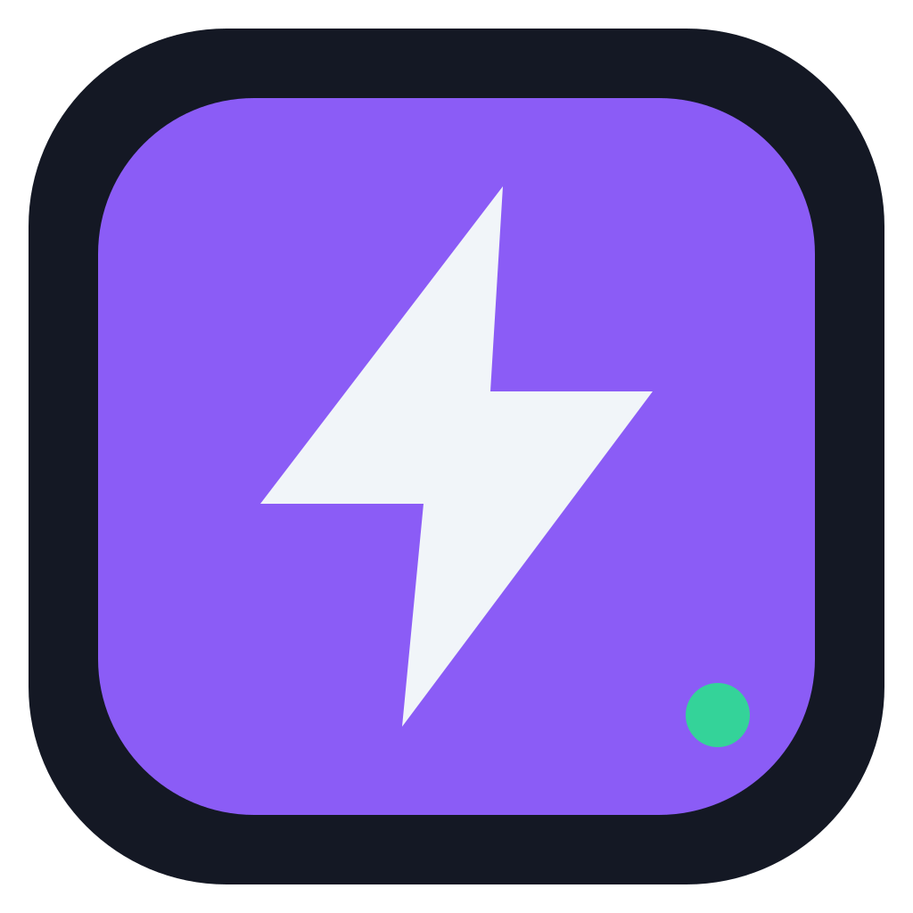
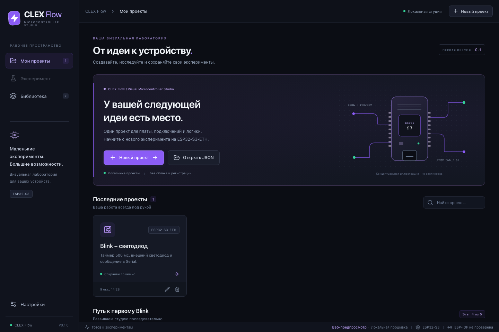
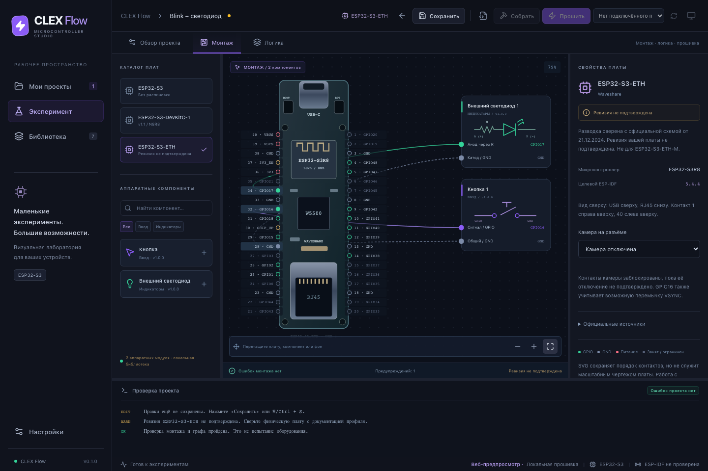
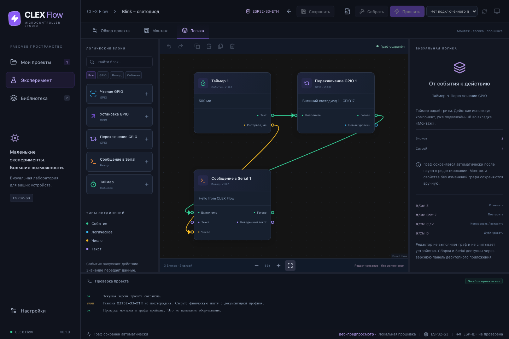

<p align="center">
  
</p>

<h1 align="center">CLEX Flow</h1>
<p align="center">Visual Microcontroller Studio</p>
<p align="center"><strong>0.1.0 · Work in Progress · macOS Apple Silicon · MIT</strong></p>

Визуальная среда разработки для микроконтроллеров и одноплатных компьютеров. Плата, аппаратные подключения и блоки логики объединяются в одном проекте. Проекты, инструменты и данные остаются на вашем компьютере.

CLEX Flow развивается с прицелом на семейства ESP, платы Arduino и Raspberry Pi.

Приложение находится в активной разработке. Стабильного релиза пока нет.



## Возможности

- **Проекты:** локальные JSON-файлы, поиск, импорт, экспорт и защита несохранённых изменений.
- **Монтаж:** SVG-профили плат, внешний светодиод с резистором и кнопка, соединения и проверки GPIO.
- **Логика:** таймер, чтение, установка и переключение GPIO, сообщения в Serial. Типизированные связи, Undo/Redo и автосохранение.
- **Прошивка:** детерминированный генератор C/CMake, просмотр исходников, сборка через существующую ESP-IDF и журнал компилятора.
- **Подключение:** выбор последовательного порта, запись актуальной сборки с подтверждением и монитор 115200 бод.

Без сервера, регистрации, облака и телеметрии.

## Монтаж

Выберите плату, добавьте компоненты и соедините их физические контакты. Редактор проверяет допустимость GPIO, конфликты, питание и параметры компонентов.



## Визуальная логика

Соедините событие таймера с переключением GPIO, выберите светодиод из монтажа и задайте интервал. Схема сохраняется вместе с проектом.



## Платформы

В версии **0.1.0** реализован генератор для **ESP32-S3**. Текущая интеграция требует установленную **ESP-IDF 5.4.4**; другие версии SDK пока не поддерживаются. Расширение совместимости с ESP-IDF предусмотрено в дальнейшем развитии проекта.

В каталоге доступны документированные профили:

- Waveshare ESP32-S3-ETH.
- Espressif ESP32-S3-DevKitC-1 v1.1 N8R8.

Поддержка других семейств ESP, плат Arduino и Raspberry Pi запланирована для следующих версий.

Сборка прошивки проверена программно. Запись на физическую плату, GPIO, Serial устройства и мигание LED ещё не испытаны; аппаратная совместимость не подтверждена. Перед подключением сверяйте модель, ревизию и монтаж с документацией производителя.

## Запуск для разработки

Нужны **Node.js 22.12+**, npm, Rust и Xcode Command Line Tools. Основная платформа разработки – macOS Apple Silicon. Для редакторов ESP-IDF не требуется; для сборки firmware в версии **0.1.0** нужна существующая установка **ESP-IDF 5.4.4** с инструментами ESP32-S3.

```sh
git clone https://github.com/proxymades/clex-flow.git
cd clex-flow
npm ci
npm run desktop
```

Сборка приложения:

```sh
npm run desktop:build
```

Результат на macOS: `src-tauri/target/release/bundle/macos/CLEX Flow.app`.

Для веб-предпросмотра запустите `npm run dev` и откройте `http://127.0.0.1:1420`. В браузере проекты хранятся в localStorage; десктопная версия использует файловое хранилище. Скриншоты показывают интерфейс с демонстрационным проектом.

## Технологии

Tauri 2 · Rust · React 19 · JavaScript/JSX · Vite · React Flow · CSS · Lucide · JSON/SVG · ESP-IDF

## Проверки

```sh
npm run lint
npm test
npm run build
cargo fmt --manifest-path src-tauri/Cargo.toml --check
cargo test --manifest-path src-tauri/Cargo.toml --locked
```

UI-сценарии используют Playwright: `test:ui`, `test:assembly-ui`, `test:logic-ui`, `test:firmware-ui`. Запускайте их при работающем веб-предпросмотре и установленном Chromium. Результаты сохраняются локально в `.artifacts/`.

## Документация

- [Подключение ESP-IDF и сборка firmware](docs/esp-idf.md)
- [Профили плат и распиновка](docs/boards.md)
- [Редактор логики](docs/logic.md)
- [Формат проектов](docs/project-format.md)
- [Модули компонентов](docs/module-format.md)
- [Архитектура](docs/architecture.md)
- [Сборка установщиков и выпуск версий](docs/releases.md)
- [Изменения](CHANGELOG.md)

## Лицензия

Оригинальный код – [MIT License](LICENSE). Лицензии и уведомления сторонних библиотек сохранены в [THIRD_PARTY_NOTICES.md](THIRD_PARTY_NOTICES.md).
