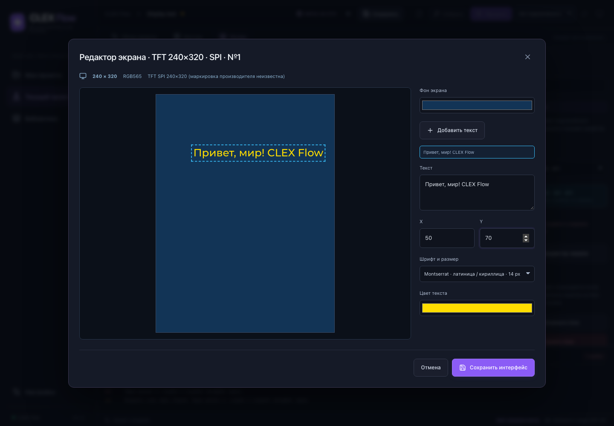

# Дисплеи и редактор экранов

Дисплей добавляется как аппаратный компонент в «Монтаже». Блок «Экран дисплея» в «Логике» выбирает этот же экземпляр устройства. Подключения и интерфейс хранятся один раз; несколько блоков могут показывать предпросмотр одного устройства.

Двойное нажатие на блок или кнопка «Открыть редактор экрана» открывают общий редактор. Доступны фон, текст, координаты, перетаскивание, цвет и размеры шрифта 14/20/28 px. «Сохранить интерфейс» переносит изменения в проект; затем проект сохраняется вручную или обычным автосохранением. «Отмена» оставляет предыдущий интерфейс.



## Первый модуль

В каталоге реализован TFT-модуль SPI 240×320 на контроллере ST7789, RGB565, с внутренним подключением подсветки. Производитель и маркировка модуля не установлены. Его профиль описывает конкретную конфигурацию; другие модули с тем же контроллером могут требовать другого разрешения, смещений, питания и инициализации.

Для проверочной схемы ESP32-S3-ETH:

| Контакт дисплея | Контакт платы |
| --- | --- |
| VCC | 3V3 |
| GND | GND |
| SCL / SCLK | GPIO16 |
| SDA / MOSI | GPIO17 |
| CS | GPIO18 |
| DC | GPIO15 |
| RES / RST | GPIO38 |

Отдельного BL в этом профиле нет. Используется SPI3, 20 МГц, режим 0, RGB, инверсия включена, смещения нулевые. Для доступности GPIO камеры в проекте нужно подтвердить, что камера отключена. Назначайте именно физические контакты своего модуля, сверив подключение.

Генератор использует `esp_lcd` из ESP-IDF 5.4.4 и LVGL 9.2.2. При первой сборке дисплейной прошивки официальный Component Manager загружает закреплённую зависимость LVGL в отдельный каталог проекта сборки. Установка SDK не изменяется. Статическому экрану не нужен событийный путь от таймера. Первая реализация драйвера поддерживает один активный дисплей; интерфейсы разных экземпляров редактор хранит раздельно.

## Unicode и шрифты

Текст сохраняется как Unicode в UTF-8 JSON и передаётся LVGL в UTF-8. В предпросмотре используется тот же Montserrat Medium, из которого официальным `lv_font_conv` созданы шрифты прошивки. Включены доступные глифы Basic Latin и Cyrillic, включая русские буквы и «Ё/ё»: 316 глифов на размер, 4 bpp. Полный Unicode в прошивку не включается. Неиспользуемые размеры шрифта удаляются линкером из итогового образа.

Тестовая надпись: «Привет, мир! CLEX Flow». Символы, которых нет в выбранном наборе, показываются как ошибка до сборки. Предпросмотр браузера и LVGL используют разные растеризаторы; предпросмотр показывает композицию и поддерживаемые символы, но не обещает идентичность каждого пикселя.

Наборы символов описаны в `src/displays/fonts/character-sets.json`. Другой язык добавляется соответствующим набором и шрифтом с нужными глифами, затем шрифты преобразуются официальным конвертером:

```sh
npm install --prefix .artifacts/font-converter --ignore-scripts --no-audit --no-fund lv_font_conv@1.5.3
node scripts/generate-display-fonts.mjs
```

Конвертер нужен разработчику для подготовки ресурсов; приложение и SDK Manager не требуют его установки. Generated C хранится в `lvgl-fonts.json` и используется одинаково фронтендом и нативной подготовкой сборки. Лицензии исходного шрифта и LVGL сохранены рядом с ресурсами.

## Расширение каталога

- Контроллер описывается в `src/catalog/controllers/`; модель модуля – отдельным JSON в `src/catalog/modules/` с полем `display` и собственными `terminals`.
- `display` содержит модель, контроллер, интерфейс, разрешение, цветовые форматы, инициализацию, платформы, `driverKey` и графические возможности. Редактор читает эти возможности, а не названия моделей или плат.
- Плата описывает целевую платформу, MCU, питание и доступные аппаратные интерфейсы. Текущий генератор реализован для ESP32-S3; другие платформы требуют отдельной реализации генератора/драйверов.
- Драйвер выбирается по платформе и ключу. Сейчас реализован `esp-idf/st7789-spi`; аппаратная инициализация отделена от общего создания объектов LVGL.
- Новый модуль с реализованным драйвером добавляется JSON/SVG без изменения редактора экрана. Новый контроллер требует своего драйвера и регистрации; графический редактор остаётся общим.

I2C, параллельные дисплеи, OLED, страницы, картинки, динамические значения и интерактивные элементы пока не реализованы.

Проверена реальная компиляция статического экрана с кириллицей. Пользователь подтвердил запись прошивки на Waveshare ESP32-S3-ETH и работу физического TFT-дисплея ST7789.

Источники: [официальный пример ESP-IDF](https://github.com/espressif/esp-idf/blob/v5.4.4/examples/peripherals/lcd/spi_lcd_touch/main/spi_lcd_touch_example_main.c), [LVGL 9.2.2](https://components.espressif.com/components/lvgl/lvgl/versions/9.2.2), [конвертер шрифтов LVGL](https://github.com/lvgl/lv_font_conv).
